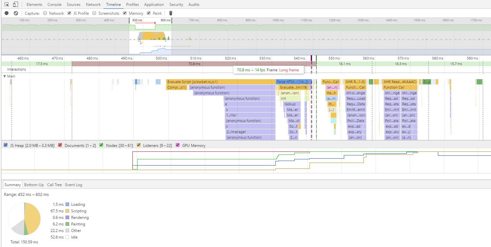
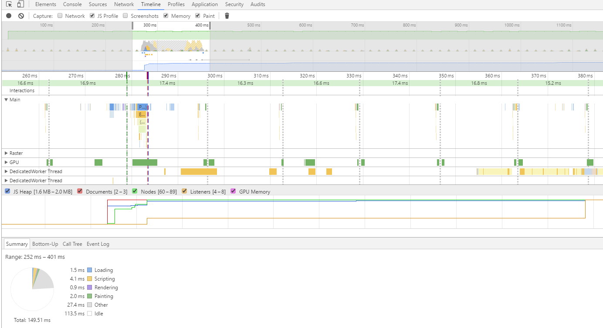

# Node MP Demo

## Changelog

Introduce Web Worker to the page to handle socket communication and reduce load on main thread.

There is a long frame and a significant drop down in fps rate as you can see on an image below (before refactoring):

Frames and fps rate normalized, and time spent on page load also reduced after refactoring.

**Note:**

Browsers will block your attempt to load web worker script, because of security reason.
Fortunately, you can avoid this restriction.

In Chrome by running next command:

    "<your path to>\chrome.exe" --allow-file-access-from-files